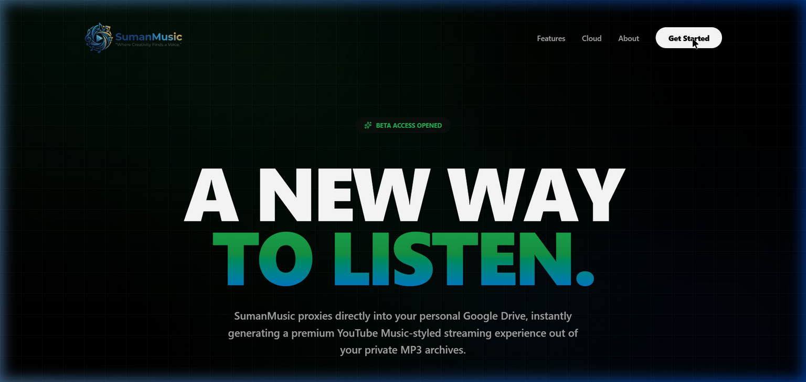
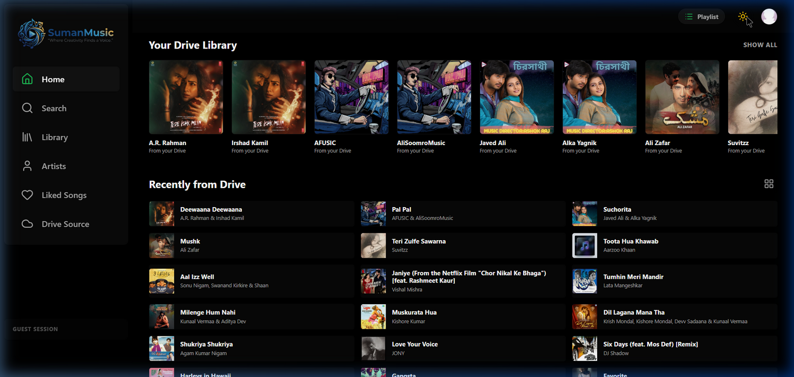
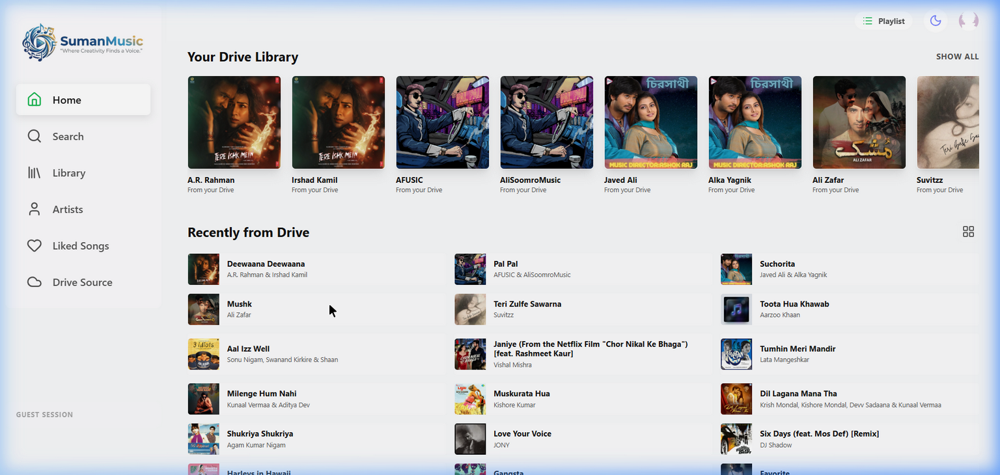
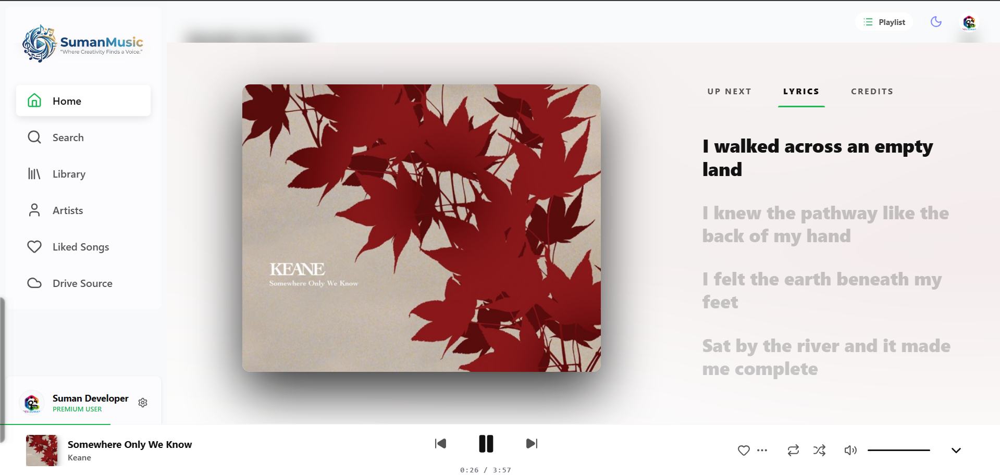
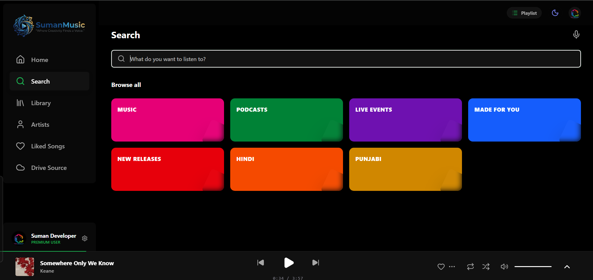

<div align="center">


# 🎵 SumanMusic
### The Ultimate Personal Music Streaming Ecosystem.

[](https://reactjs.org/)
[](https://vitejs.dev/)
[](https://tailwindcss.com/)
[](https://firebase.google.com/)
[](LICENSE)

[Explore the App](https://songs.sumanonline.com/) · [Report Bug](https://github.com/suman/SumanMusic/issues) · [Request Feature](https://github.com/suman/SumanMusic/issues)

</div>

---

## ✨ Overview

SumanMusic is a high-performance, aesthetically-driven music application that bridges your Google Drive storage with a world-class streaming interface. Built with **React 19** and **Vite 8**, it offers a "Spotify-like" experience for your own private audio collection, complete with real-time lyrics, cloud-synced playlists, and deep OS integration.

---

## 🚀 Key Features & Capabilities

### 🌐 Online Library (YouTube)
- **YouTube-Powered Streaming**: A dedicated "Online Library" view with trending music and genre exploration.
- **Smart Quota Management**: Automatic API key rotation and failover to maximize availability despite YouTube's daily limit.
- **Unified Engine**: Seamlessly switch between local Google Drive tracks and YouTube songs with a single player.

### 🔍 Search & Voice
- **Voice Search (Mic)**: One-tap hands-free searching using the Web Speech API.
- **Expanded Genres**: Interactive genre grid with 16+ categories and smooth entrance animations.
- **Real-Time Results**: Instant search across both your local library and global music trends.

### 🛠️ Administrative Control
- **Admin Panel**: Dedicated dashboard for monitoring session data and managing global feature flags.
- **Feature Management**: Admins can toggle the Online Library or restrict it to logged-in users only.

### 🔐 Security & Persistence
- **Firebase Core**: Real-time Firestore sync for your liked songs, playlists, and user preferences.
- **Encrypted Environment**: All API keys and secrets are strictly managed via environment variables, ensuring zero exposure in the repository.
- **Guest Access**: Fully functional "Guest Mode" for users who prefer localized persistence without signing into Google.

---

## 🛠️ Technical Architecture

### Core Technologies
- **Frontend**: `React 19` (Latest stability and performance)
- **Styling**: `Tailwind CSS 4` (High-efficiency utility-first styling)
- **State Management**: Context API with specialized hooks (`usePlayer`, `useAuth`, `useGDrive`).
- **Animations**: `Framer Motion` for smooth transitions and layout animations.
- **Database**: `Cloud Firestore` for real-time data persistence.
- **Streaming**: Direct integration with `Google Drive API` for low-latency audio delivery.

### Internal Project Structure
```text
SumanMusic/
├── src/
│   ├── components/      # Reusable UI (MusicPlayer, Sidebar, List/Grid views)
│   ├── context/         # Centralized state (Player, Auth, GDrive, Theme)
│   ├── hooks/           # Business logic (useAudio, usePlayer hooks)
│   ├── services/        # API integrations (Google Drive, Lyrics, Metadata)
│   ├── views/           # Page transitions (Home, Library, Search, Administrative)
│   └── lib/             # Third-party config (Firebase, Utils)
├── public/              # Static assets and PWA manifests
└── .env_example         # Security template for contributors
```

---

## 🏁 Getting Started

### 1. Prerequisites
- **Node.js**: v18+ 
- **Firebase Project**: A free Firebase project for Auth and Firestore.
- **Google Cloud Console**: Enabled Drive API and API credentials.

### 2. Setup

1. **Clone & Install**
   ```bash
   git clone https://github.com/suman/SumanMusic.git
   cd SumanMusic
   npm install
   ```

2. **Environment Configuration**
   Copy the example template to create your secure `.env` file:
   ```bash
   cp .env_example .env
   ```
   *Fill in your Firebase credentials and Google API keys in the `.env` file.*

3. **Launch**
   ```bash
   npm run dev
   ```

---

## 📸 Screenshots

<div align="center">
  
  <p><i>The Landing Page: A premium entry point into your music ecosystem.</i></p>

  <br>

  <table style="width:100%">
    <tr>
      <td width="50%"></td>
      <td width="50%"></td>
    </tr>
    <tr>
      <td align="center"><b>Elegant Dark Mode</b></td>
      <td align="center"><b>Clean Light Mode</b></td>
    </tr>
  </table>

  <br>

  <table style="width:100%">
    <tr>
      <td width="50%"></td>
      <td width="50%"></td>
    </tr>
    <tr>
      <td align="center"><b>Immersive Player & Lyrics</b></td>
      <td align="center"><b>Smart Search & Categories</b></td>
    </tr>
  </table>
</div>

---

## 🤝 Contributing & Support

We welcome all contributors! Whether it's a bug fix, feature request, or styling improvement, feel free to open a PR.

1. Fork the repo.
2. Create your branch (`git checkout -b feature/NewFeature`).
3. Commit (`git commit -m 'Add NewFeature'`).
4. Push (`git push origin feature/NewFeature`).
5. Open a Pull Request.

---

## 📄 License
Distributed under the **MIT License**. See `LICENSE` for details.

<div align="center">

Built with ❤️ by [SumanCH8514](https://github.com/SumanCH8514/)

</div>
